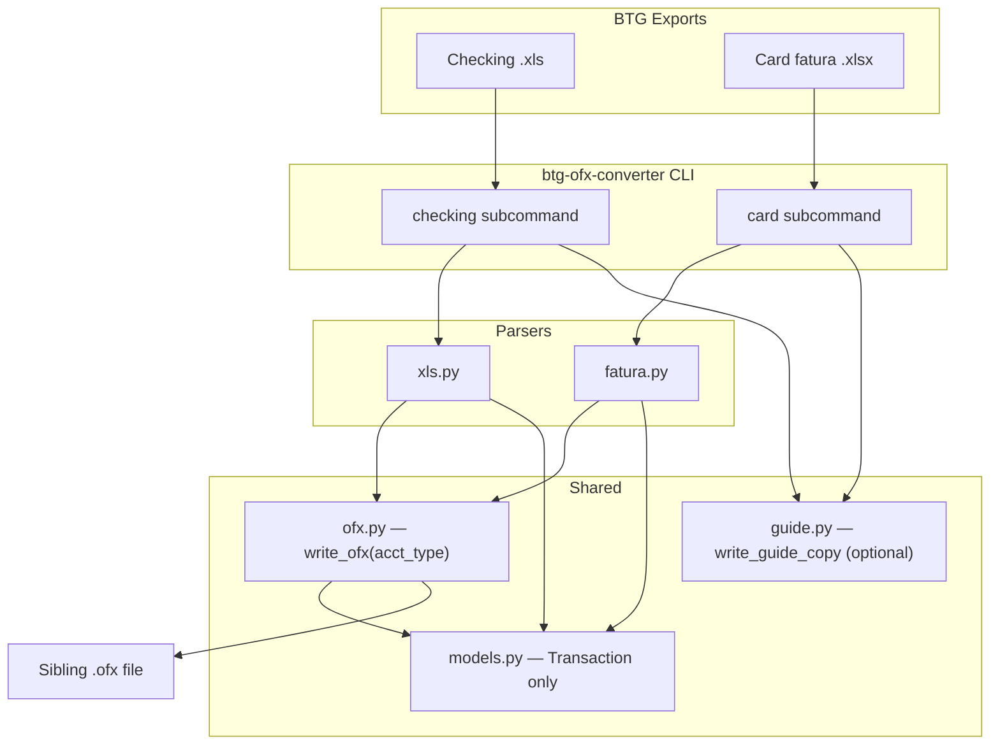

# BTG OFX Converter — Public Repo Plan

## Goal

Publish a focused, non-tech-friendly tool that converts **BTG Pactual** bank exports to OFX:

| Command                                  | Input                             | Output        |
| ---------------------------------------- | --------------------------------- | ------------- |
| `btg-ofx-converter checking extrato.xls` | Checking-account `.xls` export    | `extrato.ofx` |
| `btg-ofx-converter card fatura.xlsx`     | Credit card fatura `.xlsx` export | `fatura.ofx`  |

Repo path: `/home/joaovictornsv/Documents/dev/github/btg-ofx-converter`  
Remote: `https://github.com/joaovictornsv/btg-ofx-converter`  
Initial release: `v0.1.0`

**Scope:** standalone conversion only — no classification, merge, or HTML reports (those stay in `financial-script`).

---

## Design decisions

| Topic | Decision | Rationale |
| ----- | -------- | --------- |
| Entry point | `convert.py` with `checking` / `card` subcommands | Replaces `convert_xls_to_ofx.py`; card has parser but no CLI today |
| Output location | `{input_stem}.ofx` next to input file | Same as existing checking CLI; predictable for non-tech users |
| `Transaction` model | Fields only — drop report helpers (`is_expense`, etc.) | OFX path uses raw fields; helpers are report-only |
| Credit card OFX (v0.1.0) | Same `BANKMSGSRSV1` envelope; `<ACCTTYPE>CREDITCARD</ACCTTYPE>` | Minimal change; matches what `write_ofx` already emits for checking |
| Credit card OFX (future) | Optional `CREDITCARDMSGSRSV1` / `CCSTMTRS` if importers reject v0.1.0 | Only if a target app (Quicken, GNUCash, etc.) fails — out of scope for v0.1.0 |
| Sample `.xls` fixture | `scripts/generate-examples.py` uses **xlwt** (dev-only) | `xlrd` is read-only; reuse `SAMPLE_ROWS` layout from `test_xls.py` |
| Sample `.xlsx` fixture | Reuse `_build_sample_workbook()` from `test_fatura.py` | Already matches BTG fatura layout |
| User guide | Bundled in binary + copied beside output on first run | Same pattern as `ibkr-ir` `write_guide_copy` |
| README section order | **Privacy first** (unlike `ibkr-ir`) | Bank exports are more sensitive than brokerage CSVs |
| Source repo | Read-only copy from `financial-script` | No back-port unless we intentionally sync later |

---

## Architecture



---

## Source extraction (from financial-script)

Copy and adapt from `/media/joaovictornsv/B137-2092/vault/financial-script`:

| Source | Destination | Changes |
| ------ | ----------- | ------- |
| `xls.py` | `xls.py` | No logic changes |
| `fatura.py` | `fatura.py` | No logic changes |
| `ofx.py` | `ofx.py` | Add `acct_type: str = "CHECKING"` to `write_ofx()`; card CLI passes `"CREDITCARD"` |
| `models.py` | `models.py` | **Slim:** `Transaction` dataclass only (6 fields, no properties) |
| `convert_xls_to_ofx.py` | — | Logic absorbed into `convert.py` |
| `statement.py` | — | Not ported (multi-format dispatcher stays in financial-script) |

### Slim `models.py`

Keep only:

```python
@dataclass(frozen=True)
class Transaction:
    trn_type: str
    date: str
    amount: Decimal
    memo: str
    name: str
    source: str = ""
```

Drop: `PatternRule`, `CategoryRule`, `ReportGroup`, `CategoryConfig`, `ReportTransaction`, `CategorySummary`, `ReportData`, and all `is_expense` / `is_income` properties.

### `convert.py` CLI

PyInstaller entry point and `python convert.py` target:

```python
# Usage
btg-ofx-converter checking path/to/extrato.xls
btg-ofx-converter card path/to/2026-08-15_Fatura_BTG.xlsx
```

Behavior (both subcommands):

1. Validate file exists
2. Validate extension — `.xls` for `checking`, `.xlsx` for `card` (case-insensitive)
3. Parse → `write_ofx(..., acct_type=...)`
4. Write `{input_stem}.ofx` beside input (UTF-8)
5. Call `write_guide_copy(input_path.parent)` — copies `guia-btg-ofx.html` if not already present
6. Print `OFX written to {path}` and exit 0

Errors: missing file, wrong extension, parse failure, missing `xlrd` / `openpyxl` → message on stderr, exit 1. Mirror messages from `convert_xls_to_ofx.py`.

### `ofx.py` change

```python
def write_ofx(
    period_start: str,
    period_end: str,
    transactions: list[Transaction],
    acct_type: str = "CHECKING",
) -> str:
    ...
    f"<ACCTTYPE>{acct_type}</ACCTTYPE>",
```

Add tests asserting `CREDITCARD` appears in output when passed. `parse_ofx()` unchanged (read path only used in tests).

---

## Repo structure (mirroring ibkr-ir)

```
btg-ofx-converter/
├── convert.py                 # CLI entry (checking + card)
├── guide.py                   # guide_source_path + write_guide_copy
├── xls.py
├── fatura.py
├── ofx.py
├── models.py
├── requirements.txt           # xlrd>=2.0.1, openpyxl>=3.1.0
├── btg-ofx-converter.spec     # PyInstaller (from ibkr-ir pattern)
├── scripts/
│   ├── build-binary.sh
│   └── generate-examples.py   # xlwt (.xls) + openpyxl (.xlsx); dev-only deps
├── examples/
│   ├── sample_extrato.xls     # synthetic BTG checking export
│   └── sample_fatura.xlsx     # synthetic BTG card fatura
├── docs/
│   └── guia-btg-ofx.html      # Portuguese step-by-step guide
├── tests/
│   ├── __init__.py
│   ├── test_convert.py
│   ├── test_xls.py            # trimmed (no statement.py tests)
│   ├── test_fatura.py
│   └── test_ofx.py
├── .github/workflows/release.yml
├── .gitignore                 # see below
├── LICENSE                    # MIT (same as ibkr-ir)
└── README.md
```

Reference templates from `/home/joaovictornsv/Documents/dev/github/ibkr-ir`:

- `ibkr-ir.spec` → adapt entry `convert.py`, binary name, `datas`
- `.github/workflows/release.yml` → smoke tests + artifact names
- `scripts/build-binary.sh`
- `README.md` structure (non-developers first) — **but privacy section first**

### `.gitignore`

```gitignore
# User bank exports — never commit real data
*.xls
*.xlsx
*.ofx
!examples/**

# Python / build (same as ibkr-ir)
__pycache__/
*.py[cod]
.venv/
venv/
build/
dist/
.DS_Store
```

---

## User documentation (BTG-specific, Portuguese)

### README.md (GitHub)

Section order — **Privacy first**, then usage, then developer details (intentional improvement over `ibkr-ir`):

1. **Privacy** (first section and first TOC link)
   - Runs entirely on your machine — no upload of bank data
   - Never commit real extratos/faturas or generated `.ofx` files
   - This repo contains no real account data
2. **What it does** — converts BTG exports to OFX; **only tested with BTG Pactual** formats
3. **Limitations**
   - Checking: legacy `.xls` extrato de conta corrente (not `.xlsx`)
   - Card: `.xlsx` fatura de cartão (not checking extrato)
   - Not affiliated with BTG; format may change if BTG updates exports
   - Credit card OFX uses `ACCTTYPE=CREDITCARD`; some apps may need a different OFX layout (open an issue)
4. **Report issues / feedback**
   - [GitHub Issues](https://github.com/joaovictornsv/btg-ofx-converter/issues)
   - [hi@joaovictornsv.dev](mailto:hi@joaovictornsv.dev)
5. **Recommended folder layout** for non-tech users
6. **Quick start (download — no Python)** — Releases → two commands (`checking` vs `card`)
7. **Exporting from BTG** — separate subsections per file type
8. **Quick start (from source)**
9. **Development / release** — tests, `./scripts/build-binary.sh`, tag `v*`

### `docs/guia-btg-ofx.html` (Portuguese, self-contained HTML)

Same priorities — **privacidade first**:

1. **Privacidade** — processamento 100% local; não compartilhe extratos reais
2. O que é OFX (Quicken, GNUCash, etc.)
3. **Extrato conta corrente (.xls)** — como baixar no BTG → `checking`
4. **Fatura cartão (.xlsx)** — como baixar no BTG → `card`
5. Exemplos Windows / macOS / Linux (`chmod +x`, Gatekeeper `xattr -cr`)
6. **Problemas ou sugestões** — GitHub Issues ou hi@joaovictornsv.dev
7. Troubleshooting (extensão errada, `checking` vs `card`, arquivo não encontrado)

Bundled via PyInstaller `datas=[("docs/guia-btg-ofx.html", "docs")]`; `guide.py` resolves path from `sys._MEIPASS` or repo `docs/`.

---

## Release system

Adapt `ibkr-ir/.github/workflows/release.yml`:

- **Trigger:** push tag `v*`
- **Matrix:** linux / windows / macos
- **Build:** `pyinstaller --clean btg-ofx-converter.spec`
- **Smoke tests** (bash shell on all matrix jobs):
  ```bash
  btg-ofx-converter checking examples/sample_extrato.xls
  test -f examples/sample_extrato.ofx
  btg-ofx-converter card examples/sample_fatura.xlsx
  test -f examples/sample_fatura.ofx
  ```
- **Artifacts:** `btg-ofx-converter-{linux-x86_64,windows-x86_64,macos-arm64}` + `guia-btg-ofx.html` per platform bundle
- **Publish:** `softprops/action-gh-release@v2`

Local build: `./scripts/build-binary.sh` → `dist/btg-ofx-converter` (or `.exe` on Windows)

---

## Tests

Port from `financial-script`, trimmed for standalone scope:

| Test file | Source | Changes when porting |
| --------- | ------ | -------------------- |
| `test_ofx.py` | copy | Add `test_write_ofx_credit_card_acct_type` |
| `test_xls.py` | copy | Remove `ParseStatementTests`, `RealExtratoIntegrationTests`; drop `is_expense` / `is_income` assertions; keep `FakeSheet` + `SAMPLE_ROWS` (shared with generator) |
| `test_fatura.py` | copy | Export `_build_sample_workbook` or duplicate minimally; no changes to parse tests |
| `test_convert.py` | rewrite | Cover `checking` + `card`: sibling output, missing file, wrong extension, integration with mocked parsers |

Run: `python -m unittest discover -s tests -v`

Optional CI job (before release tags): same unittest command on `ubuntu-latest` with `pip install -r requirements.txt`.

---

## Implementation phases

### Phase 1 — Core

- [ ] Copy `xls.py`, `fatura.py`; slim `models.py`
- [ ] Extend `ofx.py` with `acct_type`; add unit test
- [ ] Add `convert.py` (`checking` + `card`) and `guide.py`

### Phase 2 — Fixtures and tests

- [ ] Add `scripts/generate-examples.py` (xlwt + openpyxl); commit `examples/*`
- [ ] Port and trim tests; rewrite `test_convert.py`
- [ ] Verify: `python -m unittest discover -s tests -v`

### Phase 3 — Docs

- [ ] Write `README.md` (privacy first)
- [ ] Write `docs/guia-btg-ofx.html`

### Phase 4 — Release infra

- [ ] `requirements.txt`, `.gitignore`, MIT `LICENSE`
- [ ] `btg-ofx-converter.spec`, `scripts/build-binary.sh`
- [ ] `.github/workflows/release.yml`

### Phase 5 — Publish

- [ ] `git init`, initial commit
- [ ] `gh repo create joaovictornsv/btg-ofx-converter --public --source=. --remote=origin`
- [ ] Push `main`, tag `v0.1.0`, verify Release artifacts

---

## Publish steps

1. Complete phases 1–4 locally; all tests green
2. Initial commit on `main`
3. `gh repo create joaovictornsv/btg-ofx-converter --public --source=. --remote=origin`
4. `git push -u origin main`
5. `git tag v0.1.0 && git push origin v0.1.0`
6. Confirm GitHub Actions Release contains all platform binaries + guide HTML

---

## Out of scope

- No changes to the original `financial-script` repo
- No credit card + checking merge/dedup (stays in financial-script)
- No `statement.py` multi-format dispatcher
- No OFX read CLI (parse only used in tests)
- No signed/notarized macOS binaries (document Gatekeeper workaround)
- No `CREDITCARDMSGSRSV1` envelope unless v0.1.0 importers fail (track via issues)
