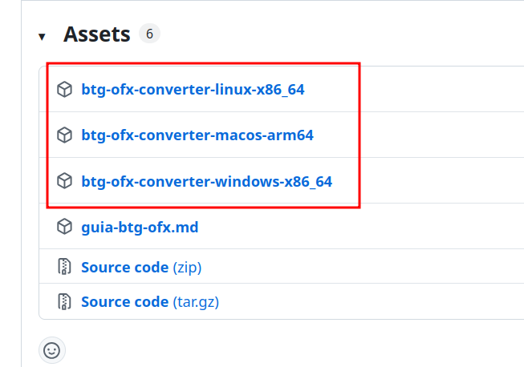

# BTG para OFX

Programa gratuito que converte exportações do **BTG Pactual** para o formato **OFX** — para importar no seu app de finanças (Quicken, GNUCash, etc.).

> Ferramenta não oficial. Não tem ligação com o BTG Pactual.

---

## Privacidade

- Roda **100% no seu computador**
- **Não** envia extratos, faturas ou dados bancários para nenhum servidor
- **Não** precisa de internet para converter
- Não compartilhe seus arquivos do banco publicamente

---

## O que faz

Converte dois tipos de arquivo do BTG:

| O que é | Arquivo do BTG | Comando |
| ------- | -------------- | ------- |
| Extrato da **conta corrente** | `.xls` | `checking` |
| **Fatura** do cartão de crédito | `.xlsx` | `card` |

Gera um arquivo **`.ofx`** na mesma pasta do arquivo original (mesmo nome, só muda a extensão).

---

## Como usar (depois de baixar)

### Conta corrente (extrato `.xls`)

1. Baixe o extrato no app ou site do BTG (arquivo **`.xls`**, não `.xlsx`)
2. Coloque o programa e o extrato **na mesma pasta**
3. Abra o terminal nessa pasta e rode:

**Windows**

```text
btg-ofx-converter.exe checking Extrato_2026-01.xls
```

**Mac / Linux**

```bash
./btg-ofx-converter-linux-x86_64 checking Extrato_2026-01.xls
```

4. Importe o arquivo `.ofx` gerado no seu app de finanças

---

### Cartão de crédito (fatura `.xlsx`)

1. Baixe a fatura no app ou site do BTG
2. **Abra a fatura no Excel ou LibreOffice** com a senha (o BTG envia por email ou mostra no app)
3. **Salve uma cópia sem senha** — *Arquivo → Salvar como*, deixando os campos de senha vazios
4. Coloque o programa e a **cópia sem senha** na mesma pasta
5. Rode no terminal:

**Windows**

```text
btg-ofx-converter.exe card 2026-08-15_Fatura_BTG.xlsx
```

**Mac / Linux**

```bash
./btg-ofx-converter-linux-x86_64 card 2026-08-15_Fatura_BTG.xlsx
```

6. Importe o arquivo `.ofx` gerado

---

## Como baixar o programa

1. Abra a página de **[Releases](https://github.com/joaovictornsv/btg-ofx-converter/releases)**
2. Baixe o arquivo do **seu sistema** — **não** baixe “Source code”:
   - **Windows:** `btg-ofx-converter-windows-x86_64`
   - **Mac (Apple Silicon):** `btg-ofx-converter-macos-arm64`
   - **Linux:** `btg-ofx-converter-linux-x86_64`
3. Coloque o arquivo numa **pasta fixa** (ex.: `Documentos/btg-ofx/`) junto com seus extratos e faturas
4. Na **primeira execução**, o programa copia **`guia-btg-ofx.html`** para essa pasta — **abra no navegador** (Chrome, Firefox, Edge, Safari): clique duas vezes no arquivo ou arraste para uma janela do navegador



**Mac:** na primeira execução pode aparecer aviso de segurança. Use **Ajustes do Sistema → Privacidade e Segurança → Abrir assim mesmo**.

**Linux / Mac:** pode ser preciso dar permissão uma vez:

```bash
chmod +x btg-ofx-converter-linux-x86_64
```

---

## Problemas comuns

| Problema | O que fazer |
| -------- | ----------- |
| Erro `File is not a zip file` na fatura | A fatura ainda está **com senha**. Abra no Excel/LibreOffice, salve **cópia sem senha** e tente de novo. |
| Comando `checking` não funciona | Confira se o extrato é **`.xls`** (conta corrente), não `.xlsx`. |
| Comando `card` não funciona | Confira se é a **fatura do cartão** em **`.xlsx`**, não o extrato da conta. |
| Arquivo não encontrado | Abra o terminal **dentro da pasta** onde estão o programa e o arquivo do BTG. |
| Mac bloqueia o programa | **Privacidade e Segurança → Abrir assim mesmo**, ou rode `xattr -cr ./btg-ofx-converter-macos-arm64` uma vez. |

Algo não funcionou? Abra uma [issue no GitHub](https://github.com/joaovictornsv/btg-ofx-converter/issues) ou escreva para [hi@joaovictornsv.dev](mailto:hi@joaovictornsv.dev).

---

## Para desenvolvedores

Detalhes técnicos, testes, código-fonte e publicação de versões: **[TECH_README.md](TECH_README.md)**
